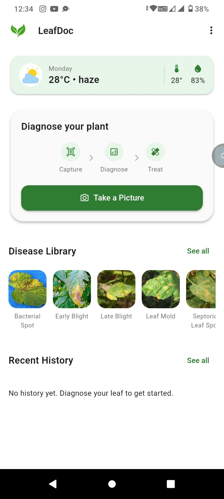
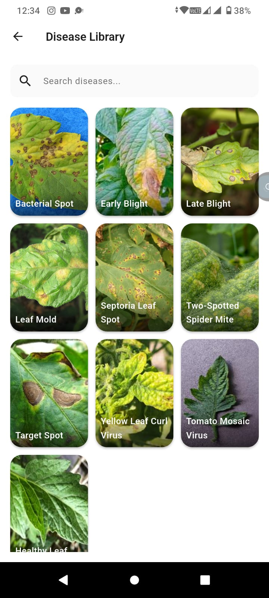

🌿 LeafDoc — AI-Based Tomato Leaf Disease Detection

A hybrid deep learning powered mobile application for real-time tomato leaf disease diagnosis.

🚀 Overview

LeafDoc is an AI-driven mobile application designed to detect and classify tomato leaf diseases with high accuracy using deep learning. The system integrates a hybrid CNN model (ResNet50 + InceptionV3) and deploys it on-device using TensorFlow Lite (TFLite) for fast, offline inference.

The app enables farmers, researchers, and agriculture enthusiasts to diagnose plant diseases instantly using their smartphone camera.

🧠 Key Features
📸 Real-time Diagnosis
Capture image or select from gallery
Instant disease prediction with confidence score
🤖 Hybrid AI Model
Combines ResNet50 (deep features) + InceptionV3 (multi-scale features)
Achieves 97.76% accuracy
📊 Confidence-Based Results
Displays predicted disease + probability
📚 Disease Library
Detailed information about each disease
Helps users understand symptoms & causes
🕒 Diagnosis History
Stores previous results locally (SharedPreferences)
Auto-deletes after 30 days
🔄 Future: Supabase cloud sync (in progress)
⚡ Offline Support
Runs fully on-device using TFLite
📱 App Architecture

The app follows a Feature-First Architecture for scalability and maintainability.

leafdoc/
├── lib/
│   ├── main.dart
│   ├── app.dart
│   ├── core/
│   │   ├── router/
│   │   ├── theme/
│   │   └── widgets/
│   └── features/
│       ├── home/
│       ├── detect_disease/
│       ├── disease_library/
│       ├── history/
│       ├── about/
│       ├── settings/
│       └── splash/
├── assets/
│   ├── images/
│   ├── icons/
│   └── models/
│       ├── tomato_model.tflite
│       └── class_indices.json
├── android/
├── web/
├── pubspec.yaml
└── README.md

🧪 AI Model Details
Component	Description
Architecture	Hybrid CNN (ResNet50 + InceptionV3)
Dataset	PlantVillage (35,420 images)
Classes	10 (9 diseases + healthy)
Accuracy	97.76%
Input Size	224 × 224 × 3
Deployment	TensorFlow Lite (TFLite)
🔍 Model Highlights
Parallel feature extraction
Feature-level fusion (concatenation)
Two-stage transfer learning:
Feature extraction
Selective fine-tuning
Optimized with:
Adam optimizer
Cosine LR schedule
Label smoothing
Mixed precision training
🛠️ Tech Stack

Frontend (Mobile App):

Flutter (Material 3)
Dart

Machine Learning:

TensorFlow / Keras
TensorFlow Lite (TFLite)

Storage:

SharedPreferences (Local)
Supabase (Planned)

Development Environment:

Google Colab (Model Training)
NVIDIA Tesla T4 GPU
📸 Screenshots

📦 Model Integration (TFLite)
Model converted to .tflite
Loaded locally in Flutter app
Performs on-device inference for fast predictions
🔮 Future Improvements
☁️ Supabase integration for cloud history sync
🌍 Multi-language support
📈 More crop & disease support
🧑‍🌾 Farmer-friendly UI enhancements
🔄 Real-time model updates
📊 Research Contribution

This project is based on a research work proposing:

✅ Hybrid CNN Architecture
✅ Efficient Feature Fusion
✅ Deployment-aware Optimization
✅ Real-world robustness for agricultural environments

👨‍💻 Author

MD Naimur Rahman

